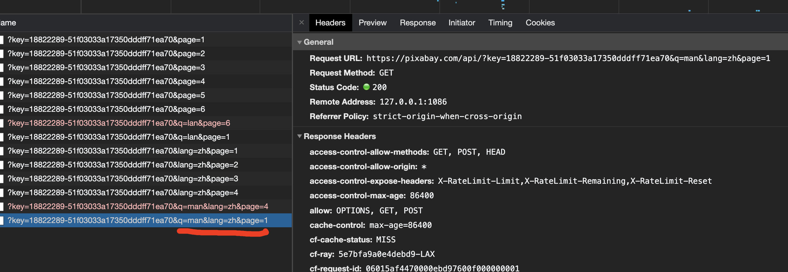
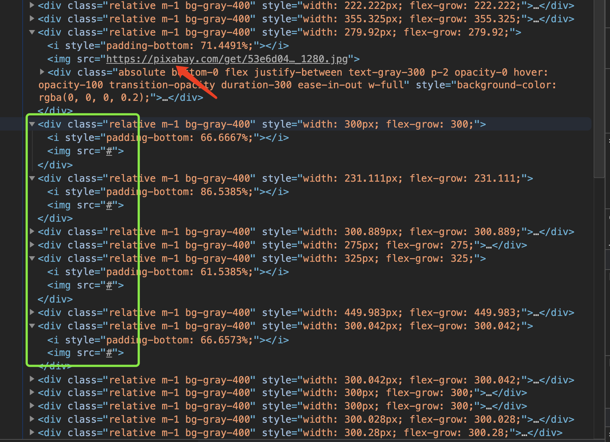
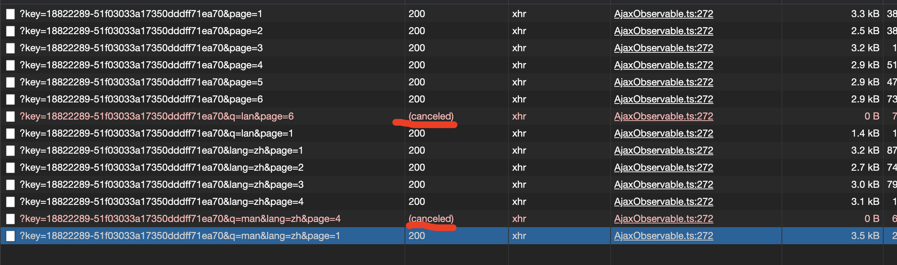

# README

## INSPIRED BY 500px

效果类似于[500px](https://500px.com/editors)

## IMPLEMENTATION

1. ~~一个即输即搜索的搜索框，无需回车或者点击搜索按钮即可自动触发搜索~~ 

1. ~~搜索结果为图片列表（可展示为grid或者瀑布流等），每个图片上需展示图片的views和likes，需支持翻页~~ 

1. ~~增加搜索条件如颜色，排序等~~

1. ~~Responsive，自适应屏幕宽度~~

1. ~~图片延迟加载~~

1. ~~瀑布流~~

1. ~~无限加载~~

1. ~~取消网络请求~~

1. 虚拟列表，瀑布流的实现方式使用了flex，实际意义上并没有行的概念，也不是一个list，待实现。
